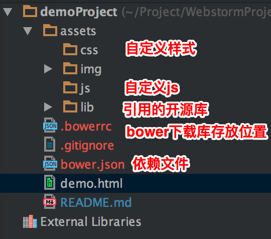
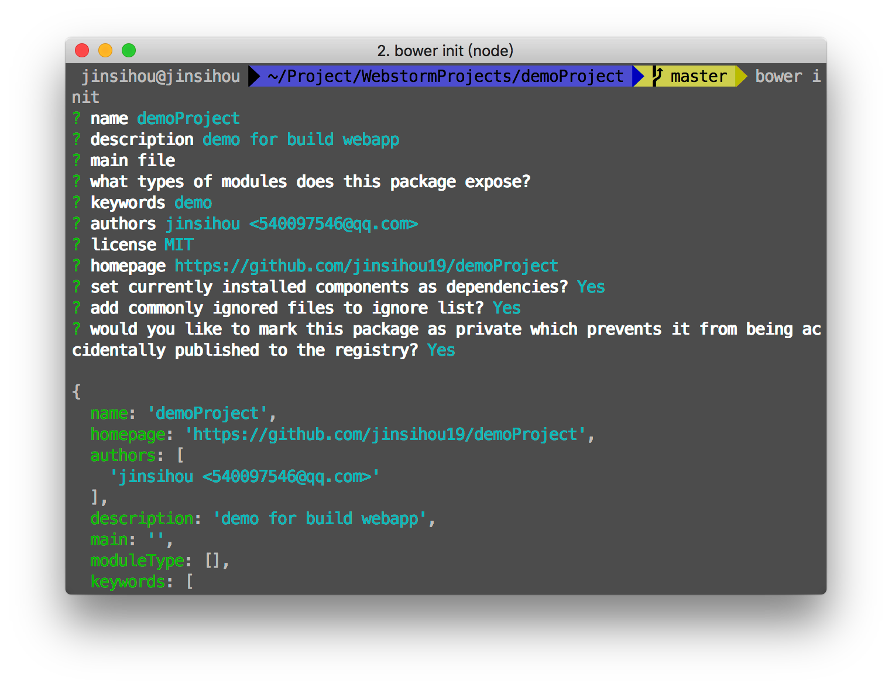

#demoProject
用于示范搭建工程

**搭建工程**

1. 建立项目文件夹如下的目录结构(都是空文件夹)
    

2. 安装bower包管理器,推荐阅读下面的安装教程:

    >https://segmentfault.com/a/1190000000349555

3. 安装好bower之后,切换到项目文件夹下,新建一个.bowerrc文件,在其中加入代码
    
        {
            "directory" : "assets/lib"
        }

    并保存;

4. 打开命令行切换到项目文件下

    `` bower install bootstrap ``
    
    到项目下就发现在bower_components目录下安装好了bootstrap和jquery,因为bower会自动管理依赖,所以自动安装了jquery;

5. 依旧在项目文件夹下,在命令行运行:

    ``bower init``
    
    这里有个参考
     
     
    
    然后按照提示选择选项,就可以了,完成这步,就完成项目的创建了,使用WebStorm打开就可以进行开发.
   

**clone工程的运行**

1. (clone别人的工程的时候使用)当clone一份有bower.json的项目时,切换到项目文件夹下,在命令行运行:

    ``bower install``
    
    这时候,所有的依赖库都会安装完毕.
    
2. 使用WebStorm打开工程就可以进行开发了.
    
    
    
**关于.gitignore要写什么**
**这里注意要将依赖库的文件夹和工程配置都加到忽略名单中,本工程的.gitignore参考内容如下:**

    .idea
    node_modules
    assets/lib